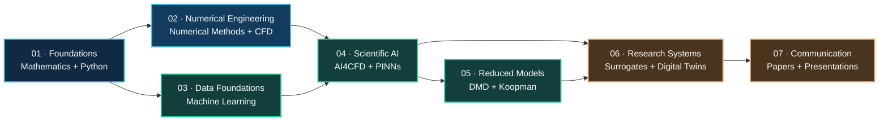
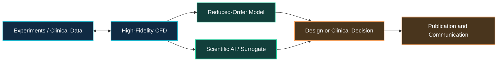

<p align="center">
  <picture>
    <source media="(prefers-color-scheme: dark)" srcset="./assets/images/research-hub-banner-dark.svg">
    <source media="(prefers-color-scheme: light)" srcset="./assets/images/research-hub-banner-light.svg">
    
  </picture>
</p>

<h1 align="center">Mechanical CFD & Scientific AI Research Hub</h1>

<p align="center">
  Structured learning pathways, verified resources, and project-oriented guidance
  for computational engineering research.
</p>

<p align="center">
  <a href="./learning-paths/README.md"><strong>Learning Paths</strong></a>
  ·
  <a href="./project-guides/README.md"><strong>Project Guides</strong></a>
  ·
  <a href="./resources/catalog.md"><strong>Resource Catalog</strong></a>
  ·
  <a href="./CONTRIBUTING.md"><strong>Contribute</strong></a>
</p>

<p align="center">
  
  
  
</p>

---

## About this hub

This repository organizes independent open-source resources into a coherent research pathway for:

- computational fluid dynamics and numerical methods;
- mechanical and aerospace engineering applications;
- machine learning for fluid mechanics;
- Dynamic Mode Decomposition and Koopman-based reduced-order modeling;
- physics-informed and scientific machine learning;
- finite-element, multiphase and image-analysis workflows;
- scientific writing, presentation and research communication.

> [!NOTE]
> This is a navigation and explanation hub. It links to independent upstream repositories rather than copying their source code. Every external project remains governed by its own license.

<br>

<p>
  <strong>Choose your pathway</strong>
</p>

<hr>

<table>
<tr>
<td width="33%" valign="top" align="center">
  <br>
  <p align="center">
  <strong>Build foundations</strong>
  </p>
  Mathematics, Python, numerical methods and machine-learning prerequisites.<br><br>
  <a href="./learning-paths/foundations.md"><strong>Start learning →</strong></a>
</td>
<td width="33%" valign="top" align="center">
  <br>
  <p align="center">
  <strong>Develop engineering models</strong>
  </p>
  CFD, FEA, multiphase flow, verification, validation and engineering applications.<br><br>
  <a href="./learning-paths/cfd.md"><strong>Explore CFD →</strong></a>
</td>
<td width="33%" valign="top" align="center">
  <br>
  <p align="center">
  <strong>Apply scientific AI</strong>
  </p>
  DMD, Koopman models, PINNs, surrogate modeling and AI4CFD.<br><br>
  <a href="./learning-paths/scientific-ai.md"><strong>Explore Scientific AI →</strong></a>
</td>
</tr>
</table>

<br>

<p>
  <strong>Research learning roadmap</strong>
</p>

<hr>



<p align="center">
  <a href="./learning-paths/README.md"><strong>View the complete learning paths →</strong></a>
</p>

<br>

<p>
  <strong>Featured research pathways</strong>
</p>

<hr>

<table>
<tr>
<td width="50%" valign="top">
  <p align="center"></p>
  <p align="center">
  <strong>Biofluids CFD & Digital Twins</strong>
  </p>
  <p align="center">CT geometry → meshing → patient-specific CFD → physiological metrics → ROM → clinical prediction</p>
  <p align="center"><a href="./project-guides/medical-cfd.md"><strong>Explore pathway →</strong></a></p>
</td>
<td width="50%" valign="top">
  <p align="center"></p>
  <p align="center">
  <strong>Turbomachinery Optimization</strong>
  </p>
  <p align="center">CAD geometry → mesh independence → RANS CFD → experimental validation → design optimization</p>
  <p align="center"><a href="./project-guides/turbomachinery.md"><strong>Explore pathway →</strong></a></p>
</td>
</tr>
<tr>
<td width="50%" valign="top">
  <p align="center"></p>
  <p align="center">
  <strong>PIV & Reduced-Order Modeling</strong>
  </p>
  <p align="center">Snapshot preprocessing → modal decomposition → temporal analysis → flow reconstruction</p>
  <p align="center"><a href="./project-guides/piv-rom.md"><strong>Explore pathway →</strong></a></p>
</td>
<td width="50%" valign="top">
  <p align="center"></p>
  <p align="center">
  <strong>Multiphase Flow & Cavitation</strong>
  </p>
  <p align="center">Multiphase CFD → bubble detection → cavitation metrics → image analysis → AI-assisted prediction</p>
  <p align="center"><a href="./project-guides/multiphase.md"><strong>Explore pathway →</strong></a></p>
</td>
</tr>
</table>

<p align="center">
  <a href="./project-guides/README.md"><strong>Browse all project guides →</strong></a>
</p>

<br>

<p>
  <strong>Resource collections</strong>
</p>

<hr>

| Collection | Resources | Primary purpose |
|---|---:|---|
| Research practice | 3 | Research planning and engineering maps |
| Mathematics and programming | 4 | Python, mathematics and numerical prerequisites |
| Machine learning and AI | 5 | General data-driven modeling foundations |
| CFD and numerical solvers | 7 | Numerical CFD, solver development and fluid mechanics |
| Scientific AI and ROM | 5 | AI4CFD, DMD, Koopman methods and PINNs |
| Specialized applications | 2 | FEA, multiphase flow and image analysis |
| Research communication | 2 | Thesis preparation and presentation support |

<p align="center">
  <a href="./resources/catalog.md"><strong>Browse all 28 verified resources →</strong></a>
</p>

<br>

<p>
  <strong>Featured core toolkit</strong>
</p>

<hr>

<table>
<tr>
<td width="50%" valign="top">

<p><strong>CFDPython</strong></p>

`CORE` `BEGINNER–INTERMEDIATE` `JUPYTER`

Progressive numerical CFD training through the 12 Steps to Navier–Stokes.

**Best for:** Connecting governing equations with Python implementation.  
**Source:** [barbagroup/CFDPython](https://github.com/barbagroup/CFDPython)

</td>
<td width="50%" valign="top">

<p><strong>ML Foundations</strong></p>

`CORE` `BEGINNER–INTERMEDIATE` `JUPYTER`

Mathematics and computer-science foundations for machine learning and reduced-order modeling.

**Best for:** Preparing for DMD, autoencoders, Koopman methods and PINNs.  
**Source:** [jonkrohn/ML-foundations](https://github.com/jonkrohn/ML-foundations)

</td>
</tr>
<tr>
<td width="50%" valign="top">

<p><strong>PyDMD</strong></p>

`CORE` `INTERMEDIATE–ADVANCED` `PYTHON`

A comprehensive Python library for Dynamic Mode Decomposition methods.

**Best for:** CFD/PIV modal analysis, reconstruction and ROM benchmarking.  
**Source:** [PyDMD/PyDMD](https://github.com/PyDMD/PyDMD)

</td>
<td width="50%" valign="top">

<p><strong>Awesome AI4CFD</strong></p>

`CORE` `INTERMEDIATE–ADVANCED` `LITERATURE`

A structured survey of machine-learning research for computational fluid dynamics.

**Best for:** Literature reviews, method selection and proposal development.  
**Source:** [WillDreamer/Awesome-AI4CFD](https://github.com/WillDreamer/Awesome-AI4CFD)

</td>
</tr>
</table>

<br>

<p>
  <strong>Resource classification</strong>
</p>

<hr>

| Label | Meaning |
|---|---|
| **Core** | Directly supports the principal CFD–AI learning pathway |
| **Supporting** | Strengthens prerequisites or implementation ability |
| **Specialized** | Intended for a particular method or application |
| **Reference** | Mainly used to discover additional resources |
| **Optional** | Useful for productivity or communication |

<br>

<p>
  <strong>Repository organization</strong>
</p>

<hr>

```text
mechanical-cfd-ai-research-hub/
├── README.md
├── assets/
│   ├── images/
│   └── icons/
├── learning-paths/
│   ├── README.md
│   ├── foundations.md
│   ├── cfd.md
│   └── scientific-ai.md
├── project-guides/
│   ├── README.md
│   ├── medical-cfd.md
│   ├── turbomachinery.md
│   ├── piv-rom.md
│   ├── multiphase.md
│   ├── fsi.md
│   └── research-communication.md
├── resources/
│   ├── README.md
│   ├── catalog.md
│   └── catalog.yml
├── .github/workflows/link-check.yml
├── CONTRIBUTING.md
├── LICENSE
└── NOTICE.md
```

<br>

<p>
  <strong>How the hub supports research</strong>
</p>

<hr>



<br>

<p>
  <strong>Contributing</strong>
</p>

<hr>

Resources should be added only after checking their relevance, upstream source, license, maintenance status, and suitability for a defined learning or research pathway.

[Read the contribution guide →](./CONTRIBUTING.md)

<br>

<p>
  <strong>License and attribution</strong>
</p>

<hr>

The MIT license in this hub applies only to the original organization, descriptions, documentation, and assets created for this repository. Every linked repository remains governed by its own upstream license.

[Read the attribution notice →](./NOTICE.md)

---

<p align="center">
  Maintained by <strong>Md. Didarul Islam</strong><br>
  Mechanical Engineering · CFD · Scientific AI
</p>

<!-- documentation-status-refresh: 2026-07-16-green-status-refresh -->
