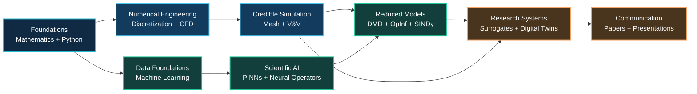
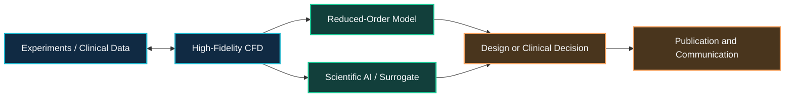

  <picture>
    <source media="(prefers-color-scheme: dark)" srcset="./assets/images/research-hub-banner-dark.svg">
    <source media="(prefers-color-scheme: light)" srcset="./assets/images/research-hub-banner-light.svg">
    
  </picture>

<h1 align="center">Mechanical, CFD & Scientific AI Research Hub</h1>

  Structured learning pathways, verified resources and project-oriented guidance
  for computational engineering research.

  <a href="./learning-paths/README.md"><strong>Learning Paths</strong></a>
  ·
  <a href="./project-guides/README.md"><strong>Project Guides</strong></a>
  ·
  <a href="./resources/catalog.md"><strong>Resource Catalog</strong></a>
  ·
  <a href="./resources/selection-guide.md"><strong>Selection Guide</strong></a>
  ·
  <a href="./CONTRIBUTING.md"><strong>Contribute</strong></a>

  
  
  
  

---

# About this hub

This repository organizes independent open-source resources into coherent pathways for:

- computational fluid dynamics and numerical methods;
- mechanical and aerospace engineering applications;
- machine learning for fluid mechanics;
- Dynamic Mode Decomposition and Koopman-based reduced-order modeling;
- physics-informed and scientific machine learning;
- finite-element, multiphase and image-analysis workflows;
- scientific writing, presentation and research communication.

> [!NOTE]
> This is a navigation and explanation hub. It links to independent upstream repositories rather than copying their source code. Every external project remains governed by its own license.

---

<strong>▌ Choose your pathway</strong>

<table>
<tr>
<td width="33%" valign="top" align="center">
   
  
<strong>Build foundations</strong>

  Mathematics, Python, numerical methods, and machine-learning prerequisites.  
  <a href="./learning-paths/foundations.md"><strong>Start learning →</strong></a>
</td>
<td width="33%" valign="top" align="center">
   
  
<strong>Develop engineering models</strong>

  CFD, FEA, meshing, multiphase flow, verification, validation, and engineering applications.  
  <a href="./learning-paths/cfd.md"><strong>Explore CFD →</strong></a>
</td>
<td width="33%" valign="top" align="center">
   
  
<strong>Apply scientific AI</strong>

  DMD, Koopman models, PINNs, neural operators, surrogates, and AI4CFD.  
  <a href="./learning-paths/scientific-ai.md"><strong>Explore Scientific AI →</strong></a>
</td>
</tr>
</table>

---

<strong>▌ Research learning roadmap</strong>

  <a href="./learning-paths/README.md"><strong>View the complete learning paths →</strong></a>

---

<strong>▌ Featured research pathways</strong>

<table>
<tr>
<td width="50%" valign="top">
  

  
<strong>Medical CFD & Digital Twins</strong>

  
CT/MRI → segmentation → geometry → patient-specific CFD → physiological metrics → ROM → prediction

  
<a href="./project-guides/medical-cfd.md"><strong>Explore pathway →</strong></a>

</td>
<td width="50%" valign="top">
  

  
<strong>Turbomachinery Optimization</strong>

  
CAD → mesh independence → RANS/URANS → experiment → surrogate → multi-objective optimization

  
<a href="./project-guides/turbomachinery.md"><strong>Explore pathway →</strong></a>

</td>
</tr>
<tr>
<td width="50%" valign="top">
  

  
<strong>PIV & Reduced-Order Modeling</strong>

  
Images or snapshots → preprocessing → POD/DMD → Operator Inference → reconstruction and prediction

  
<a href="./project-guides/piv-rom.md"><strong>Explore pathway →</strong></a>

</td>
<td width="50%" valign="top">
  

  
<strong>Multiphase Flow & Cavitation</strong>

  
Multiphase CFD → bubble detection → cavitation metrics → validation → AI-assisted prediction

  
<a href="./project-guides/multiphase.md"><strong>Explore pathway →</strong></a>

</td>
</tr>
</table>

  <a href="./project-guides/fsi.md"><strong>Solid Mechanics & FSI</strong></a>
  ·
  <a href="./project-guides/verification-validation.md"><strong>Verification & Validation</strong></a>
  ·
  <a href="./project-guides/surrogate-optimization.md"><strong>Surrogate Modeling & Optimization</strong></a>

---

<strong>▌ Resource collections</strong>

| Collection | Resources | Primary purpose |
|---|---:|---|
| Research Practice & Engineering Maps | 3 | Research planning and multidisciplinary engineering maps |
| Mathematics & Programming Foundations | 4 | Python, mathematics, and numerical prerequisites |
| Machine Learning & AI | 5 | Data-driven modeling and AI foundations |
| CFD Foundations & Numerical Solvers | 10 | Numerical CFD, production solvers, and fluid mechanics |
| Meshing, Post-processing & Data Interchange | 4 | Reproducible mesh generation, conversion, and analysis |
| Verification, Validation & Benchmark Data | 3 | Turbulence-model verification and benchmark datasets |
| Scientific AI, ROM & Differentiable Physics | 15 | DMD, OpInf, SINDy, PINNs, neural operators, and differentiable CFD |
| Optimization, Surrogates & Uncertainty | 2 | DOE, surrogate modeling, and multi-objective design |
| Biofluids & Medical Modeling | 3 | Segmentation, anatomical geometry, and patient-specific simulation |
| Experimental Flow & Image Analysis | 3 | PIV, bubble detection, and experimental data processing |
| Solid Mechanics & Fluid–Structure Interaction | 3 | FEA, custom PDEs, and partitioned multiphysics coupling |
| Research Communication & Productivity | 2 | Thesis preparation and presentation support |

  <a href="./resources/catalog.md"><strong>Browse all 57 verified resources →</strong></a>
  ·
  <a href="./resources/selection-guide.md"><strong>Select tools by research task →</strong></a>

---

# ▌ Featured core toolkit

<table>
<tr>
<td width="50%" valign="top">

<strong>CFDPython</strong>

`CORE` `BEGINNER–INTERMEDIATE` `JUPYTER`

Progressive numerical CFD training through the 12 Steps to Navier–Stokes.

**Best for:** Connecting governing equations with Python implementation.  
**Source:** [barbagroup/CFDPython](https://github.com/barbagroup/CFDPython)

</td>
<td width="50%" valign="top">

<strong>ML Foundations</strong>

`CORE` `BEGINNER–INTERMEDIATE` `JUPYTER`

Mathematics and computer-science foundations for machine learning and reduced-order modeling.

**Best for:** Preparing for DMD, autoencoders, Koopman methods, and PINNs.  
**Source:** [jonkrohn/ML-foundations](https://github.com/jonkrohn/ML-foundations)

</td>
</tr>
<tr>
<td width="50%" valign="top">

<strong>PyDMD</strong>

`CORE` `INTERMEDIATE–ADVANCED` `PYTHON`

A comprehensive Python library for Dynamic Mode Decomposition methods.

**Best for:** CFD/PIV modal analysis, reconstruction, and ROM benchmarking.  
**Source:** [PyDMD/PyDMD](https://github.com/PyDMD/PyDMD)

</td>
<td width="50%" valign="top">

<strong>Awesome AI4CFD</strong>

`CORE` `INTERMEDIATE–ADVANCED` `LITERATURE`

A structured survey of machine-learning research for computational fluid dynamics.

**Best for:** Literature reviews, method selection, and proposal development.  
**Source:** [WillDreamer/Awesome-AI4CFD](https://github.com/WillDreamer/Awesome-AI4CFD)

</td>
</tr>
</table>

---

<strong>▌ Resource classification</strong>

<table>
  <thead>
    <tr>
      <th align="left">Label</th>
      <th align="left">Meaning</th>
    </tr>
  </thead>
  <tbody>
    <tr>
      <td align="left"><strong>Core</strong></td>
      <td align="left">Directly supports a principal CFD–AI learning pathway</td>
    </tr>
    <tr>
      <td align="left"><strong>Supporting</strong></td>
      <td align="left">Strengthens prerequisites or implementation ability</td>
    </tr>
    <tr>
      <td align="left"><strong>Specialized</strong></td>
      <td align="left">Intended for a focused method or application</td>
    </tr>
    <tr>
      <td align="left"><strong>Reference</strong></td>
      <td align="left">Primarily used to discover additional resources</td>
    </tr>
    <tr>
      <td align="left"><strong>Optional</strong></td>
      <td align="left">Useful for productivity or communication</td>
    </tr>
  </tbody>
</table>

---

## ▌ How the hub supports research

---

## ▌ Contributing

Resources should be added only after checking relevance, upstream source, license, maintenance status and suitability for a defined learning or research pathway.

[Read the contribution guide →](./CONTRIBUTING.md)

---

## ▌ License and attribution

The MIT license in this hub applies only to the original organization, descriptions, documentation, scripts and visual assets created for this repository. Every linked repository remains governed by its own upstream license.

[Read the attribution notice →](./NOTICE.md)

---

  Maintained by <strong>Md. Didarul Islam</strong> 
  Mechanical Engineering · CFD · Scientific AI

