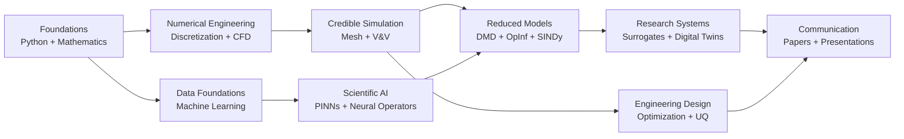

<picture>
  <source media="(prefers-color-scheme: dark)" srcset="./assets/images/research-hub-banner-dark.svg">
  <source media="(prefers-color-scheme: light)" srcset="./assets/images/research-hub-banner-light.svg">
  
</picture>

# Mechanical, CFD & Scientific AI Research Hub

Structured learning pathways, verified resources, and project-oriented guidance for computational engineering research.

[Learning Paths](./learning-paths/README.md) · [Project Guides](./project-guides/README.md) · [Resource Catalog](./resources/catalog.md) · [Selection Guide](./resources/selection-guide.md) · [Contribute](./CONTRIBUTING.md)

> [!NOTE]
> This is a navigation and explanation hub. It links to independent upstream projects rather than copying their source code. Every external project remains governed by its own license and usage terms.

## What is new in this enhanced edition

- Expanded from **28 to 57 curated resources**
- Added production CFD solvers and differentiable simulation frameworks
- Added meshing, mesh conversion, and reproducible post-processing tools
- Added authoritative verification, validation, and turbulence datasets
- Added neural operators, benchmark suites, system identification, and Operator Inference
- Added engineering optimization, surrogate modeling, medical CFD, PIV, and FSI resources
- Added automated catalog validation for duplicate URLs, invalid categories, and count mismatches

## Choose your pathway

| Goal | Start here | Expected outcome |
|---|---|---|
| Build foundations | [Foundations](./learning-paths/foundations.md) | Python, mathematics, numerical thinking, and ML readiness |
| Develop credible CFD models | [CFD and Numerical Engineering](./learning-paths/cfd.md) | Solver understanding, meshing, verification, validation, and interpretation |
| Apply scientific AI | [Scientific AI and ROM](./learning-paths/scientific-ai.md) | DMD, Operator Inference, PINNs, neural operators, and digital twins |
| Select the right software | [Resource Selection Guide](./resources/selection-guide.md) | A task-based choice instead of a popularity-based list |

## Research learning roadmap



## Featured project pathways

| Pathway | Workflow |
|---|---|
| [Biofluids CFD & Digital Twins](./project-guides/medical-cfd.md) | Medical images → segmentation → geometry → patient-specific CFD → ROM → clinical prediction |
| [Turbomachinery & Pump Optimization](./project-guides/turbomachinery.md) | CAD → mesh study → RANS/URANS → experiment → surrogate → multi-objective optimization |
| [PIV & Reduced-Order Modeling](./project-guides/piv-rom.md) | Image pairs → vector fields → preprocessing → POD/DMD/OpInf → reconstruction and prediction |
| [Multiphase Flow & Cavitation](./project-guides/multiphase.md) | Multiphase model → time-step study → vapor/bubble field → image validation → prediction |
| [Solid Mechanics & FSI](./project-guides/fsi.md) | Solid verification + fluid verification → coupling → interface conservation → validation |
| [Verification & Validation](./project-guides/verification-validation.md) | Code verification → solution verification → validation → uncertainty statement |
| [Surrogate Modeling & Optimization](./project-guides/surrogate-optimization.md) | DOE → simulations → surrogate → validation → optimization → final CFD verification |

## Resource collections

| Collection | Resources |
|---|---:|
| Research Practice & Engineering Maps | 3 |
| Mathematics & Programming Foundations | 4 |
| Machine Learning & AI | 5 |
| CFD Foundations & Numerical Solvers | 10 |
| Meshing, Post-processing & Data Interchange | 4 |
| Verification, Validation & Benchmark Data | 3 |
| Scientific AI, ROM & Differentiable Physics | 15 |
| Optimization, Surrogates & Uncertainty | 2 |
| Biofluids & Medical Modeling | 3 |
| Experimental Flow & Image Analysis | 3 |
| Solid Mechanics & Fluid–Structure Interaction | 3 |
| Research Communication & Productivity | 2 |

[Browse all 57 verified resources →](./resources/catalog.md)

## Featured core toolkit

### CFDPython
`CORE` `BEGINNER–INTERMEDIATE`  
Progressive numerical CFD training through the 12 Steps to Navier–Stokes.

### OpenFOAM and SU2
`CORE` `INTERMEDIATE–ADVANCED`  
Production-scale CFD workflows, solver customization, compressible flow, adjoints, and engineering design.

### NASA TMR and ERCOFTAC
`CORE` `INTERMEDIATE–ADVANCED`  
Turbulence-model verification and established validation cases.

### PyDMD, flowTorch, and Operator Inference
`CORE` `INTERMEDIATE–ADVANCED`  
Transparent reduced-order baselines for CFD and PIV data.

### NeuralOperator, DeepXDE, and PDEBench
`CORE` `INTERMEDIATE–ADVANCED`  
Modern scientific-ML methods and standardized comparison tasks.

### 3D Slicer, VMTK, and SimVascular
`CORE / SPECIALIZED` `BEGINNER–ADVANCED`  
Medical image processing, anatomical geometry, vascular simulation, and physiological modeling.

## Repository organization

```text
mechanical-cfd-ai-research-hub/
├── README.md
├── learning-paths/
│   ├── README.md
│   ├── foundations.md
│   ├── cfd.md
│   └── scientific-ai.md
├── project-guides/
│   ├── README.md
│   ├── medical-cfd.md
│   ├── turbomachinery.md
│   ├── piv-rom.md
│   ├── multiphase.md
│   ├── fsi.md
│   ├── verification-validation.md
│   └── surrogate-optimization.md
├── resources/
│   ├── README.md
│   ├── selection-guide.md
│   ├── catalog.md
│   └── catalog.yml
├── scripts/
│   └── validate_catalog.py
├── .github/workflows/
│   └── link-check.yml
├── CONTRIBUTING.md
├── LICENSE
└── NOTICE.md
```

## Quality policy

A resource is included only when it:

1. has an identifiable upstream source;
2. contributes to a defined learning or research workflow;
3. offers substantial value beyond an existing entry;
4. can be described accurately without overstating its capability;
5. is assigned a clear level and role;
6. is checked through the catalog-validation workflow.

## License and attribution

The repository license applies only to the original organization, descriptions, documentation, scripts, and assets created for this hub. Linked projects remain governed by their own licenses.

Maintained by **Md. Didarul Islam**  
Mechanical Engineering · CFD · Scientific AI
