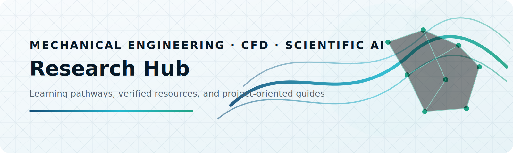
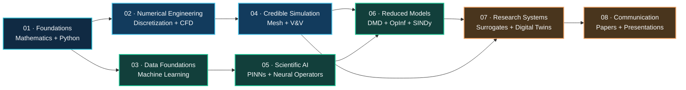
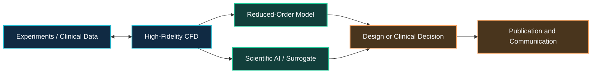

<p align="center">
  <picture>
    <source media="(prefers-color-scheme: dark)" srcset="./assets/images/research-hub-banner-dark.svg">
    <source media="(prefers-color-scheme: light)" srcset="./assets/images/research-hub-banner-light.svg">
    
  </picture>
</p>

<h1 align="center">Mechanical, CFD & Scientific AI Research Hub</h1>

<p align="center">
  Structured learning pathways, verified resources and project-oriented guidance
  for computational engineering research.
</p>

<p align="center">
  <a href="./learning-paths/README.md"><strong>Learning Paths</strong></a>
  ·
  <a href="./project-guides/README.md"><strong>Project Guides</strong></a>
  ·
  <a href="./resources/catalog.md"><strong>Resource Catalog</strong></a>
  ·
  <a href="./resources/selection-guide.md"><strong>Selection Guide</strong></a>
  ·
  <a href="./CONTRIBUTING.md"><strong>Contribute</strong></a>
</p>

<p align="center">
  
  
  
  
</p>

---

## About this hub

This repository organizes independent open-source resources into coherent pathways for:

- computational fluid dynamics, numerical methods and respective solvers;
- mechanical, aerospace, turbomachinery and multiphase engineering;
- medical-image-based CFD and patient-specific simulation;
- experimental flow analysis using PIV and image processing;
- Dynamic Mode Decomposition, Koopman methods and reduced-order modeling;
- PINNs, neural operators, differentiable physics and scientific machine learning;
- surrogate modeling, engineering optimization verification, and validation;
- scientific writing, presentation and reproducible research communication.

> [!NOTE]
> This is a navigation and explanation hub. It links to independent upstream repositories rather than copying their source code. Every external project remains governed by its own license.

## Choose your pathway

<table>
<tr>
<td width="33%" valign="top" align="center">
  <br>
  <h3>Build foundations</h3>
  Mathematics, Python, numerical methods and machine-learning prerequisites.<br><br>
  <a href="./learning-paths/foundations.md"><strong>Start learning →</strong></a>
</td>
<td width="33%" valign="top" align="center">
  <br>
  <h3>Develop engineering models</h3>
  CFD, FEA, meshing, multiphase flow, verification, validation and engineering applications.<br><br>
  <a href="./learning-paths/cfd.md"><strong>Explore CFD →</strong></a>
</td>
<td width="33%" valign="top" align="center">
  <br>
  <h3>Apply scientific AI</h3>
  DMD, Koopman models, PINNs, neural operators, surrogates and AI4CFD.<br><br>
  <a href="./learning-paths/scientific-ai.md"><strong>Explore Scientific AI →</strong></a>
</td>
</tr>
</table>

## Research learning roadmap



<p align="center">
  <a href="./learning-paths/README.md"><strong>View the complete learning paths →</strong></a>
</p>

## Featured research pathways

<table>
<tr>
<td width="50%" valign="top">
  <p align="center"></p>
  <h3 align="center">Medical CFD & Digital Twins</h3>
  <p align="center">CT/MRI → segmentation → geometry → patient-specific CFD → physiological metrics → ROM → prediction</p>
  <p align="center"><a href="./project-guides/medical-cfd.md"><strong>Explore pathway →</strong></a></p>
</td>
<td width="50%" valign="top">
  <p align="center"></p>
  <h3 align="center">Turbomachinery Optimization</h3>
  <p align="center">CAD → mesh independence → RANS/URANS → experiment → surrogate → multi-objective optimization</p>
  <p align="center"><a href="./project-guides/turbomachinery.md"><strong>Explore pathway →</strong></a></p>
</td>
</tr>
<tr>
<td width="50%" valign="top">
  <p align="center"></p>
  <h3 align="center">PIV & Reduced-Order Modeling</h3>
  <p align="center">Images or snapshots → preprocessing → POD/DMD → Operator Inference → reconstruction and prediction</p>
  <p align="center"><a href="./project-guides/piv-rom.md"><strong>Explore pathway →</strong></a></p>
</td>
<td width="50%" valign="top">
  <p align="center"></p>
  <h3 align="center">Multiphase Flow & Cavitation</h3>
  <p align="center">Multiphase CFD → bubble detection → cavitation metrics → validation → AI-assisted prediction</p>
  <p align="center"><a href="./project-guides/multiphase.md"><strong>Explore pathway →</strong></a></p>
</td>
</tr>
</table>

<p align="center">
  <a href="./project-guides/fsi.md"><strong>Solid Mechanics & FSI</strong></a>
  ·
  <a href="./project-guides/verification-validation.md"><strong>Verification & Validation</strong></a>
  ·
  <a href="./project-guides/surrogate-optimization.md"><strong>Surrogate Modeling & Optimization</strong></a>
</p>

## Resource collections

| Collection | Resources | Primary purpose |
|---|---:|---|
| Research Practice & Engineering Maps | 3 | Research planning and multidisciplinary engineering maps |
| Mathematics & Programming Foundations | 4 | Python, mathematics and numerical prerequisites |
| Machine Learning & AI | 5 | Data-driven modeling and AI foundations |
| CFD Foundations & Numerical Solvers | 10 | Numerical CFD, production solvers and fluid mechanics |
| Meshing, Post-processing & Data Interchange | 4 | Reproducible mesh generation, conversion and analysis |
| Verification, Validation & Benchmark Data | 3 | Turbulence-model verification and benchmark datasets |
| Scientific AI, ROM & Differentiable Physics | 15 | DMD, OpInf, SINDy, PINNs, neural operators and differentiable CFD |
| Optimization, Surrogates & Uncertainty | 2 | DOE, surrogate modeling and multi-objective design |
| Biofluids & Medical Modeling | 3 | Segmentation, anatomical geometry and patient-specific simulation |
| Experimental Flow & Image Analysis | 3 | PIV, bubble detection, and experimental data processing |
| Solid Mechanics & Fluid–Structure Interaction | 3 | FEA, custom PDEs and partitioned multiphysics coupling |
| Research Communication & Productivity | 2 | Thesis preparation and presentation support |

<p align="center">
  <a href="./resources/catalog.md"><strong>Browse all 57 verified resources →</strong></a>
  ·
  <a href="./resources/selection-guide.md"><strong>Select tools by research task →</strong></a>
</p>

## Featured core toolkit

<table>
<tr>
<td width="50%" valign="top">

### CFDPython

`CORE` `BEGINNER–INTERMEDIATE` `JUPYTER`

Progressive numerical CFD training through the 12 Steps to Navier–Stokes.

**Best for:** Connecting governing equations with transparent Python implementation.  
**Source:** [barbagroup/CFDPython](https://github.com/barbagroup/CFDPython)

</td>
<td width="50%" valign="top">

### OpenFOAM + SU2

`CORE` `INTERMEDIATE–ADVANCED` `CFD`

Production finite-volume CFD, compressible flow, adjoint design, and solver customization.

**Best for:** Moving from educational solvers to research-scale engineering workflows.  
**Sources:** [OpenFOAM-dev](https://github.com/OpenFOAM/OpenFOAM-dev) · [SU2](https://github.com/su2code/SU2)

</td>
</tr>
<tr>
<td width="50%" valign="top">

### NASA TMR + ERCOFTAC

`CORE` `INTERMEDIATE–ADVANCED` `V&V`

Authoritative turbulence-model definitions and established validation cases.

**Best for:** Verification, benchmark selection, and defensible CFD reporting.  
**Sources:** [NASA TMR](https://tmbwg.github.io/turbmodels/) · [ERCOFTAC](https://cfd.mace.manchester.ac.uk/ercoftac/)

</td>
<td width="50%" valign="top">

### PyDMD + flowTorch + Operator Inference

`CORE` `INTERMEDIATE–ADVANCED` `ROM`

Modal analysis, fluid-data access, and physics-structured non-intrusive reduced models.

**Best for:** CFD/PIV decomposition, prediction, and ROM benchmarking.  
**Sources:** [PyDMD](https://github.com/PyDMD/PyDMD) · [flowTorch](https://github.com/AndreWeiner/flowtorch) · [Operator Inference](https://github.com/Willcox-Research-Group/rom-operator-inference-Python3)

</td>
</tr>
<tr>
<td width="50%" valign="top">

### NeuralOperator + DeepXDE + PDEBench

`CORE` `INTERMEDIATE–ADVANCED` `SCIENTIFIC ML`

Neural operators, PINNs, DeepONets, and standardized scientific-ML benchmarks.

**Best for:** Field surrogates and physics-informed learning after establishing reliable baselines.  
**Sources:** [NeuralOperator](https://github.com/neuraloperator/neuraloperator) · [DeepXDE](https://github.com/lululxvi/deepxde) · [PDEBench](https://github.com/pdebench/PDEBench)

</td>
<td width="50%" valign="top">

### 3D Slicer + VMTK + SimVascular

`CORE / SPECIALIZED` `BEGINNER–ADVANCED` `MEDICAL CFD`

Medical-image segmentation, anatomical modeling, meshing, and patient-specific simulation.

**Best for:** Reproducible biofluid and physiological boundary-condition workflows.  
**Sources:** [3D Slicer](https://github.com/Slicer/Slicer) · [VMTK](https://github.com/vmtk/vmtk) · [SimVascular](https://github.com/SimVascular/SimVascular)

</td>
</tr>
</table>

## Resource classification

| Label | Meaning |
|---|---|
| **Core** | Directly supports a principal CFD–AI learning pathway |
| **Supporting** | Strengthens prerequisites or implementation ability |
| **Specialized** | Intended for a focused method or application |
| **Reference** | Primarily used to discover additional resources |
| **Optional** | Useful for productivity or communication |

## Repository organization

```text
mechanical-cfd-ai-research-hub/
├── README.md
├── assets/
│   ├── images/
│   └── icons/
├── learning-paths/
│   ├── README.md
│   ├── foundations.md
│   ├── cfd.md
│   └── scientific-ai.md
├── project-guides/
│   ├── README.md
│   ├── medical-cfd.md
│   ├── turbomachinery.md
│   ├── piv-rom.md
│   ├── multiphase.md
│   ├── fsi.md
│   ├── verification-validation.md
│   ├── surrogate-optimization.md
│   └── research-communication.md
├── resources/
│   ├── README.md
│   ├── selection-guide.md
│   ├── catalog.md
│   └── catalog.yml
├── scripts/
│   └── validate_catalog.py
├── .github/workflows/
│   └── link-check.yml
├── requirements-docs.txt
├── CONTRIBUTING.md
├── LICENSE
└── NOTICE.md
```

## How the hub supports research



## Contributing

Resources should be added only after checking relevance, upstream source, license, maintenance status and suitability for a defined learning or research pathway.

[Read the contribution guide →](./CONTRIBUTING.md)

## License and attribution

The MIT license in this hub applies only to the original organization, descriptions, documentation, scripts and visual assets created for this repository. Every linked repository remains governed by its own upstream license.

[Read the attribution notice →](./NOTICE.md)

---

<p align="center">
  Maintained by <strong>Md. Didarul Islam</strong><br>
  Mechanical Engineering · CFD · Scientific AI
</p>
