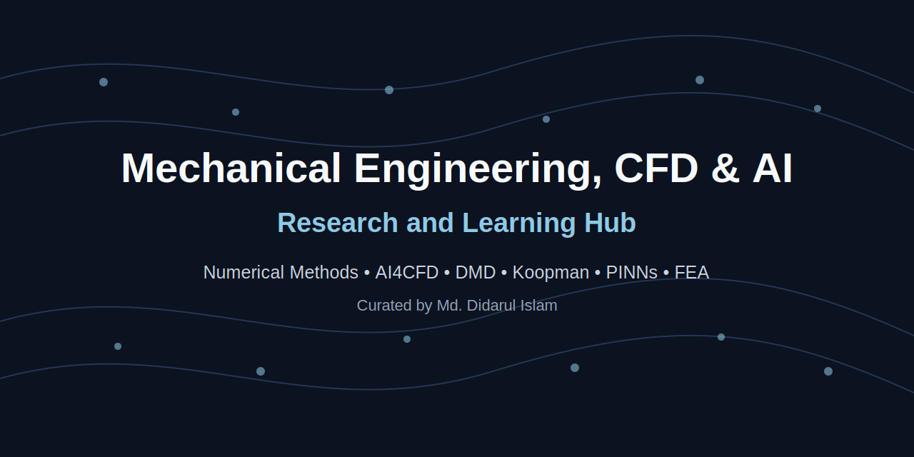
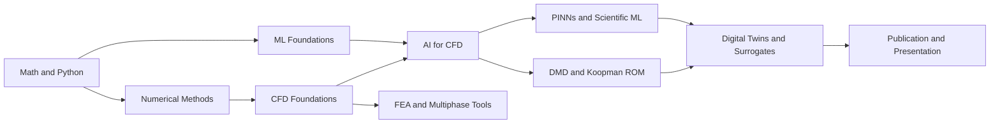

# Mechanical Engineering, CFD & AI Research Hub

A curated research and learning ecosystem maintained by **Md. Didarul Islam** for mechanical engineering, computational fluid dynamics, numerical methods, AI for CFD, reduced-order modeling, finite-element analysis, and scientific communication.

> This repository is a navigation and explanation hub. It links to independent repositories rather than copying their source code.

## Why this hub exists

The linked repositories are individually useful, but they serve different purposes. This hub separates them by research function, explains the benefit of each resource, identifies a recommended learning order, and connects them to practical engineering research.

## Recommended progression

## Quick navigation

- [Research Practice & Engineering Maps](#1-research-practice--engineering-maps)
- [Mathematics & Programming Foundations](#2-mathematics--programming-foundations)
- [General Machine Learning & AI](#3-general-machine-learning--ai)
- [CFD Foundations & Numerical Solvers](#4-cfd-foundations--numerical-solvers)
- [AI for CFD, ROM & Scientific ML](#5-ai-for-cfd-rom--scientific-ml)
- [FEA, Multiphase & Specialized Applications](#6-fea-multiphase--specialized-applications)
- [Research Communication & Productivity](#7-research-communication--productivity)
- [Learning paths](learning-paths/)
- [Project guides](project-guides/)
- [Machine-readable catalog](resources/catalog.yml)

## Complete repository catalog

| Repository | Segment | Type | Level | Priority | Source |
|---|---|---|---|---|---|
| [mechanical-engineering-research-skill](https://github.com/islam-md-didarul/mechanical-engineering-research-skill) | Research Practice & Engineering Maps | Research guide | All levels | Core | [Upstream](https://github.com/hanhuark/mechanical-engineering-research-skill) |
| [awesome-mecheng](https://github.com/islam-md-didarul/awesome-mecheng) | Research Practice & Engineering Maps | Curated list | All levels | Reference | [Upstream](https://github.com/m2n037/awesome-mecheng) |
| [awesome-aerospace-engineering](https://github.com/islam-md-didarul/awesome-aerospace-engineering) | Research Practice & Engineering Maps | Curated list | All levels | Reference | [Upstream](https://github.com/mahran-sayed/awesome-aerospace-engineering) |
| [maths-cs-ai-compendium](https://github.com/islam-md-didarul/maths-cs-ai-compendium) | Mathematics & Programming Foundations | Learning compendium | Beginner to advanced | Core | [Upstream](https://github.com/HenryNdubuaku/maths-cs-ai-compendium) |
| [pcc_3e](https://github.com/islam-md-didarul/pcc_3e) | Mathematics & Programming Foundations | Course resources | Beginner | Core | [Upstream](https://github.com/ehmatthes/pcc_3e) |
| [Complete-Python-Bootcamp](https://github.com/islam-md-didarul/Complete-Python-Bootcamp) | Mathematics & Programming Foundations | Notebook course | Beginner to intermediate | Supporting | [Upstream](https://github.com/krishnaik06/Complete-Python-Bootcamp) |
| [ML-foundations](https://github.com/islam-md-didarul/ML-foundations) | Mathematics & Programming Foundations | Notebook course | Beginner to intermediate | Core | [Upstream](https://github.com/jonkrohn/ML-foundations) |
| [MLOB1](https://github.com/islam-md-didarul/MLOB1) | General Machine Learning & AI | Notebook course | Beginner to intermediate | Supporting | [Upstream](https://github.com/shaiful019/MLOB1) |
| [ai-expert-roadmap](https://github.com/islam-md-didarul/ai-expert-roadmap) | General Machine Learning & AI | Roadmap | All levels | Reference | [Upstream](https://github.com/AMAI-GmbH/AI-Expert-Roadmap) |
| [ai_all_resources](https://github.com/islam-md-didarul/ai_all_resources) | General Machine Learning & AI | Curated list | All levels | Reference | [Upstream](https://github.com/nivu/ai_all_resources) |
| [best-of-ml-python](https://github.com/islam-md-didarul/best-of-ml-python) | General Machine Learning & AI | Ranked curated list | Intermediate | Supporting | [Upstream](https://github.com/lukasmasuch/best-of-ml-python) |
| [Hands-On-Large-Language-Models](https://github.com/islam-md-didarul/Hands-On-Large-Language-Models) | General Machine Learning & AI | Book code and notebooks | Intermediate | Specialized | [Upstream](https://github.com/HandsOnLLM/Hands-On-Large-Language-Models) |
| [CFDPython](https://github.com/islam-md-didarul/CFDPython) | CFD Foundations & Numerical Solvers | Notebook course | Beginner to intermediate | Core | [Upstream](https://github.com/barbagroup/CFDPython) |
| [Python_CFD](https://github.com/islam-md-didarul/Python_CFD) | CFD Foundations & Numerical Solvers | Notebook course | Beginner to intermediate | Supporting | [Upstream](https://github.com/DrZGan/Python_CFD) |
| [CFD-Python](https://github.com/islam-md-didarul/CFD-Python) | CFD Foundations & Numerical Solvers | Notebook collection | Beginner to intermediate | Supporting | [Upstream](https://github.com/kangluosee/CFD-Python) |
| [staggered-grid-lid-driven-cavity](https://github.com/islam-md-didarul/staggered-grid-lid-driven-cavity) | CFD Foundations & Numerical Solvers | Educational solver | Intermediate | Core | [Upstream](https://github.com/jeddiot/staggered-grid-lid-driven-cavity) |
| [PyCFD](https://github.com/islam-md-didarul/PyCFD) | CFD Foundations & Numerical Solvers | Research solver prototype | Intermediate to advanced | Specialized | [Upstream](https://github.com/LukeMcCulloch/PyCFD) |
| [awesome-fluid-dynamics](https://github.com/islam-md-didarul/awesome-fluid-dynamics) | CFD Foundations & Numerical Solvers | Curated list | All levels | Reference | [Upstream](https://github.com/lento234/awesome-fluid-dynamics) |
| [list-lattice-Boltzmann-codes](https://github.com/islam-md-didarul/list-lattice-Boltzmann-codes) | CFD Foundations & Numerical Solvers | Curated solver list | Intermediate to advanced | Specialized | [Upstream](https://github.com/sthavishtha/list-lattice-Boltzmann-codes) |
| [ml-cfd-learning-resources](https://github.com/islam-md-didarul/ml-cfd-learning-resources) | AI for CFD, ROM & Scientific ML | Original curated learning hub | Beginner to advanced | Core | Original |
| [ml-cfd-lecture](https://github.com/islam-md-didarul/ml-cfd-lecture) | AI for CFD, ROM & Scientific ML | Lecture materials | Intermediate | Core | [Upstream](https://github.com/AndreWeiner/ml-cfd-lecture) |
| [Awesome-AI4CFD](https://github.com/islam-md-didarul/Awesome-AI4CFD) | AI for CFD, ROM & Scientific ML | Survey and curated literature | Intermediate to advanced | Core | [Upstream](https://github.com/WillDreamer/Awesome-AI4CFD) |
| [PyDMD](https://github.com/islam-md-didarul/PyDMD) | AI for CFD, ROM & Scientific ML | Python library | Intermediate to advanced | Core | [Upstream](https://github.com/PyDMD/PyDMD) |
| [PINNs](https://github.com/islam-md-didarul/PINNs) | AI for CFD, ROM & Scientific ML | Research implementation | Advanced | Specialized | [Upstream](https://github.com/maziarraissi/PINNs) |
| [felupe](https://github.com/islam-md-didarul/felupe) | FEA, Multiphase & Specialized Applications | Python FEA library | Intermediate to advanced | Specialized | [Upstream](https://github.com/adtzlr/felupe) |
| [BubbleID](https://github.com/islam-md-didarul/BubbleID) | FEA, Multiphase & Specialized Applications | Application notebooks | Intermediate | Specialized | [Upstream](https://github.com/cldunlap73/BubbleID) |
| [LaTex-Thesis-Template](https://github.com/islam-md-didarul/LaTex-Thesis-Template) | Research Communication & Productivity | Document template | All levels | Supporting | [Upstream](https://github.com/samina1/LaTex-Thesis-Template) |
| [voice-pro](https://github.com/islam-md-didarul/voice-pro) | Research Communication & Productivity | AI media utility | Intermediate | Optional | [Upstream](https://github.com/abus-aikorea/voice-pro) |

---

## 1. Research Practice & Engineering Maps

### [mechanical-engineering-research-skill](https://github.com/islam-md-didarul/mechanical-engineering-research-skill)

**Type:** Research guide  
**Level:** All levels  
**Primary language:** Mixed  
**Priority in this hub:** Core  
**License:** MIT  
**Original upstream:** [hanhuark/mechanical-engineering-research-skill](https://github.com/hanhuark/mechanical-engineering-research-skill)  

**Main benefit.** Provides reusable workflows and research-oriented guidance for mechanical-engineering investigations.

**Recommended use.** Use as the top-level research-methodology reference for planning, reviewing literature, validating models, and documenting results.

### [awesome-mecheng](https://github.com/islam-md-didarul/awesome-mecheng)

**Type:** Curated list  
**Level:** All levels  
**Primary language:** Mixed  
**Priority in this hub:** Reference  
**License:** GPL-3.0  
**Original upstream:** [m2n037/awesome-mecheng](https://github.com/m2n037/awesome-mecheng)  

**Main benefit.** Provides broad mechanical-engineering resources beyond CFD, including design, mechanics, manufacturing, and thermal sciences.

**Recommended use.** Consult when a project expands beyond fluid mechanics or requires multidisciplinary engineering tools.

### [awesome-aerospace-engineering](https://github.com/islam-md-didarul/awesome-aerospace-engineering)

**Type:** Curated list  
**Level:** All levels  
**Primary language:** Mixed  
**Priority in this hub:** Reference  
**License:** GPL-3.0  
**Original upstream:** [mahran-sayed/awesome-aerospace-engineering](https://github.com/mahran-sayed/awesome-aerospace-engineering)  

**Main benefit.** Collects aerospace-learning resources spanning aerodynamics, propulsion, structures, flight mechanics, and software.

**Recommended use.** Use for aerospace-oriented CFD research, graduate-study preparation, or cross-disciplinary exploration.

## 2. Mathematics & Programming Foundations

### [maths-cs-ai-compendium](https://github.com/islam-md-didarul/maths-cs-ai-compendium)

**Type:** Learning compendium  
**Level:** Beginner to advanced  
**Primary language:** JavaScript  
**Priority in this hub:** Core  
**License:** Apache-2.0  
**Original upstream:** [HenryNdubuaku/maths-cs-ai-compendium](https://github.com/HenryNdubuaku/maths-cs-ai-compendium)  

**Main benefit.** Connects mathematics, computing, and artificial intelligence through intuition-focused explanations.

**Recommended use.** Use to review concepts that support numerical methods, machine learning, and scientific computing.

### [pcc_3e](https://github.com/islam-md-didarul/pcc_3e)

**Type:** Course resources  
**Level:** Beginner  
**Primary language:** Python  
**Priority in this hub:** Core  
**License:** See upstream  
**Original upstream:** [ehmatthes/pcc_3e](https://github.com/ehmatthes/pcc_3e)  

**Main benefit.** Offers structured Python exercises and projects suitable for researchers beginning scientific programming.

**Recommended use.** Start here before CFD scripting, data processing, or machine-learning notebooks.

### [Complete-Python-Bootcamp](https://github.com/islam-md-didarul/Complete-Python-Bootcamp)

**Type:** Notebook course  
**Level:** Beginner to intermediate  
**Primary language:** Jupyter Notebook  
**Priority in this hub:** Supporting  
**License:** GPL-3.0  
**Original upstream:** [krishnaik06/Complete-Python-Bootcamp](https://github.com/krishnaik06/Complete-Python-Bootcamp)  

**Main benefit.** Provides extended Python practice for data handling, scripting, automation, and machine-learning preparation.

**Recommended use.** Use after basic Python syntax to build research coding confidence.

### [ML-foundations](https://github.com/islam-md-didarul/ML-foundations)

**Type:** Notebook course  
**Level:** Beginner to intermediate  
**Primary language:** Jupyter Notebook  
**Priority in this hub:** Core  
**License:** MIT  
**Original upstream:** [jonkrohn/ML-foundations](https://github.com/jonkrohn/ML-foundations)  

**Main benefit.** Covers linear algebra, calculus, statistics, and computer science needed for machine learning and reduced-order modeling.

**Recommended use.** Complete before DMD, Koopman models, autoencoders, or PINNs.

## 3. General Machine Learning & AI

### [MLOB1](https://github.com/islam-md-didarul/MLOB1)

**Type:** Notebook course  
**Level:** Beginner to intermediate  
**Primary language:** Jupyter Notebook  
**Priority in this hub:** Supporting  
**License:** MIT  
**Original upstream:** [shaiful019/MLOB1](https://github.com/shaiful019/MLOB1)  

**Main benefit.** Introduces practical machine-learning workflows, preprocessing, model training, and evaluation with Python.

**Recommended use.** Use before building CFD surrogate models or classification pipelines.

### [ai-expert-roadmap](https://github.com/islam-md-didarul/ai-expert-roadmap)

**Type:** Roadmap  
**Level:** All levels  
**Primary language:** JavaScript  
**Priority in this hub:** Reference  
**License:** MIT  
**Original upstream:** [AMAI-GmbH/AI-Expert-Roadmap](https://github.com/AMAI-GmbH/AI-Expert-Roadmap)  

**Main benefit.** Maps the major knowledge areas required for long-term development in artificial intelligence.

**Recommended use.** Use as a planning reference; treat dated sections as historical guidance and verify modern tooling separately.

### [ai_all_resources](https://github.com/islam-md-didarul/ai_all_resources)

**Type:** Curated list  
**Level:** All levels  
**Primary language:** Jupyter Notebook  
**Priority in this hub:** Reference  
**License:** See upstream  
**Original upstream:** [nivu/ai_all_resources](https://github.com/nivu/ai_all_resources)  

**Main benefit.** Collects courses, books, libraries, and references across multiple artificial-intelligence domains.

**Recommended use.** Use as a discovery directory when a new AI topic appears in a research project.

### [best-of-ml-python](https://github.com/islam-md-didarul/best-of-ml-python)

**Type:** Ranked curated list  
**Level:** Intermediate  
**Primary language:** Mixed  
**Priority in this hub:** Supporting  
**License:** CC-BY-SA-4.0  
**Original upstream:** [lukasmasuch/best-of-ml-python](https://github.com/lukasmasuch/best-of-ml-python)  

**Main benefit.** Helps identify established and actively maintained Python libraries for machine learning.

**Recommended use.** Consult when selecting frameworks for training, optimization, explainability, or deployment.

### [Hands-On-Large-Language-Models](https://github.com/islam-md-didarul/Hands-On-Large-Language-Models)

**Type:** Book code and notebooks  
**Level:** Intermediate  
**Primary language:** Jupyter Notebook  
**Priority in this hub:** Specialized  
**License:** Apache-2.0  
**Original upstream:** [HandsOnLLM/Hands-On-Large-Language-Models](https://github.com/HandsOnLLM/Hands-On-Large-Language-Models)  

**Main benefit.** Demonstrates practical language-model workflows useful for document search, knowledge bases, and scientific text processing.

**Recommended use.** Use after basic machine learning for research-assistant and literature-management applications.

## 4. CFD Foundations & Numerical Solvers

### [CFDPython](https://github.com/islam-md-didarul/CFDPython)

**Type:** Notebook course  
**Level:** Beginner to intermediate  
**Primary language:** Jupyter Notebook  
**Priority in this hub:** Core  
**License:** See upstream  
**Original upstream:** [barbagroup/CFDPython](https://github.com/barbagroup/CFDPython)  

**Main benefit.** Teaches numerical CFD progressively through the well-known 12 Steps to Navier–Stokes.

**Recommended use.** Use as the first CFD programming course and the bridge between governing equations and numerical implementation.

### [Python_CFD](https://github.com/islam-md-didarul/Python_CFD)

**Type:** Notebook course  
**Level:** Beginner to intermediate  
**Primary language:** Jupyter Notebook  
**Priority in this hub:** Supporting  
**License:** See upstream  
**Original upstream:** [DrZGan/Python_CFD](https://github.com/DrZGan/Python_CFD)  

**Main benefit.** Provides a complementary CFD course implemented in Python.

**Recommended use.** Use alongside or after CFDPython to reinforce discretization and solver concepts.

### [CFD-Python](https://github.com/islam-md-didarul/CFD-Python)

**Type:** Notebook collection  
**Level:** Beginner to intermediate  
**Primary language:** Jupyter Notebook  
**Priority in this hub:** Supporting  
**License:** See upstream  
**Original upstream:** [kangluosee/CFD-Python](https://github.com/kangluosee/CFD-Python)  

**Main benefit.** Offers additional CFD coding examples for independent practice and comparison.

**Recommended use.** Use as supplementary exercises after learning the basic numerical methods.

### [staggered-grid-lid-driven-cavity](https://github.com/islam-md-didarul/staggered-grid-lid-driven-cavity)

**Type:** Educational solver  
**Level:** Intermediate  
**Primary language:** MATLAB  
**Priority in this hub:** Core  
**License:** See upstream  
**Original upstream:** [jeddiot/staggered-grid-lid-driven-cavity](https://github.com/jeddiot/staggered-grid-lid-driven-cavity)  

**Main benefit.** Demonstrates incompressible-flow solution on a staggered grid using a classic benchmark problem.

**Recommended use.** Study pressure–velocity coupling, boundary conditions, and finite-volume implementation.

### [PyCFD](https://github.com/islam-md-didarul/PyCFD)

**Type:** Research solver prototype  
**Level:** Intermediate to advanced  
**Primary language:** Python  
**Priority in this hub:** Specialized  
**License:** MIT  
**Original upstream:** [LukeMcCulloch/PyCFD](https://github.com/LukeMcCulloch/PyCFD)  

**Main benefit.** Shows the architecture of an unstructured Euler-equation solver on a two-dimensional grid.

**Recommended use.** Use after introductory CFD programming to study unstructured mesh and solver organization.

### [awesome-fluid-dynamics](https://github.com/islam-md-didarul/awesome-fluid-dynamics)

**Type:** Curated list  
**Level:** All levels  
**Primary language:** Mixed  
**Priority in this hub:** Reference  
**License:** CC0-1.0  
**Original upstream:** [lento234/awesome-fluid-dynamics](https://github.com/lento234/awesome-fluid-dynamics)  

**Main benefit.** Collects software, educational resources, and references across fluid dynamics.

**Recommended use.** Use as the broad fluid-dynamics discovery directory for theory, experiments, and computation.

### [list-lattice-Boltzmann-codes](https://github.com/islam-md-didarul/list-lattice-Boltzmann-codes)

**Type:** Curated solver list  
**Level:** Intermediate to advanced  
**Primary language:** Mixed  
**Priority in this hub:** Specialized  
**License:** See upstream  
**Original upstream:** [sthavishtha/list-lattice-Boltzmann-codes](https://github.com/sthavishtha/list-lattice-Boltzmann-codes)  

**Main benefit.** Collects open-source lattice Boltzmann codes for alternative CFD formulations.

**Recommended use.** Consult for multiphase, porous-media, microfluidic, or complex-boundary applications.

## 5. AI for CFD, ROM & Scientific ML

### [ml-cfd-learning-resources](https://github.com/islam-md-didarul/ml-cfd-learning-resources)

**Type:** Original curated learning hub  
**Level:** Beginner to advanced  
**Primary language:** Markdown  
**Priority in this hub:** Core  
**License:** MIT  
**Ownership:** Original repository in this GitHub account  

**Main benefit.** Provides your focused collection of machine-learning and CFD learning resources.

**Recommended use.** Use as the specialized AI-for-CFD sub-hub linked from this broader repository.

### [ml-cfd-lecture](https://github.com/islam-md-didarul/ml-cfd-lecture)

**Type:** Lecture materials  
**Level:** Intermediate  
**Primary language:** Jupyter Notebook  
**Priority in this hub:** Core  
**License:** GPL-3.0  
**Original upstream:** [AndreWeiner/ml-cfd-lecture](https://github.com/AndreWeiner/ml-cfd-lecture)  

**Main benefit.** Connects general machine-learning methods directly to computational fluid mechanics.

**Recommended use.** Study after introductory CFD and machine learning, before a full surrogate or ROM project.

### [Awesome-AI4CFD](https://github.com/islam-md-didarul/Awesome-AI4CFD)

**Type:** Survey and curated literature  
**Level:** Intermediate to advanced  
**Primary language:** Mixed  
**Priority in this hub:** Core  
**License:** See upstream  
**Original upstream:** [WillDreamer/Awesome-AI4CFD](https://github.com/WillDreamer/Awesome-AI4CFD)  

**Main benefit.** Organizes research on machine learning for computational fluid dynamics.

**Recommended use.** Consult during literature reviews, method selection, and proposal development.

### [PyDMD](https://github.com/islam-md-didarul/PyDMD)

**Type:** Python library  
**Level:** Intermediate to advanced  
**Primary language:** Python  
**Priority in this hub:** Core  
**License:** MIT  
**Original upstream:** [PyDMD/PyDMD](https://github.com/PyDMD/PyDMD)  

**Main benefit.** Implements Dynamic Mode Decomposition methods for extracting spatial modes and temporal dynamics from snapshot data.

**Recommended use.** Use for CFD/PIV modal analysis, reduced-order reconstruction, and benchmarking CNN-KAE or Koopman models.

### [PINNs](https://github.com/islam-md-didarul/PINNs)

**Type:** Research implementation  
**Level:** Advanced  
**Primary language:** Python  
**Priority in this hub:** Specialized  
**License:** MIT  
**Original upstream:** [maziarraissi/PINNs](https://github.com/maziarraissi/PINNs)  

**Main benefit.** Introduces physics-informed deep learning for forward, inverse, and equation-discovery problems.

**Recommended use.** Study after differential equations, neural networks, and numerical CFD.

## 6. FEA, Multiphase & Specialized Applications

### [felupe](https://github.com/islam-md-didarul/felupe)

**Type:** Python FEA library  
**Level:** Intermediate to advanced  
**Primary language:** Python  
**Priority in this hub:** Specialized  
**License:** GPL-3.0  
**Original upstream:** [adtzlr/felupe](https://github.com/adtzlr/felupe)  

**Main benefit.** Supports finite-element analysis for continuum mechanics of solid bodies.

**Recommended use.** Use for solid-mechanics learning, constitutive modeling, and preparation for FSI studies.

### [BubbleID](https://github.com/islam-md-didarul/BubbleID)

**Type:** Application notebooks  
**Level:** Intermediate  
**Primary language:** Jupyter Notebook  
**Priority in this hub:** Specialized  
**License:** Apache-2.0  
**Original upstream:** [cldunlap73/BubbleID](https://github.com/cldunlap73/BubbleID)  

**Main benefit.** Provides an application-oriented workflow for bubble identification and image-based analysis.

**Recommended use.** Evaluate for cavitation, multiphase-flow visualization, and experimental image processing.

## 7. Research Communication & Productivity

### [LaTex-Thesis-Template](https://github.com/islam-md-didarul/LaTex-Thesis-Template)

**Type:** Document template  
**Level:** All levels  
**Primary language:** LaTeX  
**Priority in this hub:** Supporting  
**License:** See upstream  
**Original upstream:** [samina1/LaTex-Thesis-Template](https://github.com/samina1/LaTex-Thesis-Template)  

**Main benefit.** Provides a starting structure for long academic documents with equations, figures, tables, and references.

**Recommended use.** Use for thesis, dissertation, report, or manuscript preparation after checking institutional formatting requirements.

### [voice-pro](https://github.com/islam-md-didarul/voice-pro)

**Type:** AI media utility  
**Level:** Intermediate  
**Primary language:** Python  
**Priority in this hub:** Optional  
**License:** MIT  
**Original upstream:** [abus-aikorea/voice-pro](https://github.com/abus-aikorea/voice-pro)  

**Main benefit.** Provides speech, transcription, audio-processing, and presentation-rehearsal utilities.

**Recommended use.** Use optionally for lecture preparation, script rehearsal, transcription, and educational content.

## Project-specific routes

| Research direction | Recommended route |
|---|---|
| Upper-airway CFD and medical digital twin | ML-foundations → CFDPython → ml-cfd-lecture → PyDMD → Awesome-AI4CFD → PINNs/CNN-KAE |
| Pump and turbomachinery | CFDPython → staggered-grid-lid-driven-cavity → PyCFD → PyDMD → AI4CFD |
| PIV and transient-flow analysis | Python foundations → snapshot preprocessing → PyDMD → flow reconstruction |
| Cavitation and multiphase analysis | CFD foundations → awesome-fluid-dynamics → BubbleID → LBM resources → AI4CFD |
| Solid mechanics and FSI | Mathematics → Python → felupe → separately validated fluid/solid models → coupled FSI |
| Scientific writing and presentation | LaTex-Thesis-Template → literature/document tools → voice-pro for rehearsal |

## Status labels

- **Core:** Directly supports the main CFD–AI research pathway.
- **Supporting:** Strengthens important prerequisite or implementation skills.
- **Specialized:** Useful for a specific method or application.
- **Reference:** Primarily used for discovering external resources.
- **Optional:** Helpful for productivity or communication but not required technically.

## License and attribution

The MIT license in this hub applies only to the original organization, descriptions, documentation, and scripts created for this repository. Every linked repository remains governed by its own license. Review the upstream license before copying, modifying, or redistributing third-party code.

See [NOTICE.md](NOTICE.md) for details.
