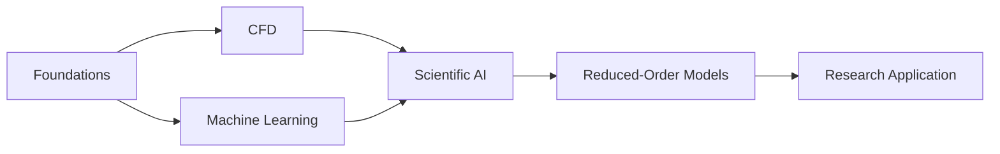

# Learning Paths

[← Main hub](../README.md)

Choose a path based on your current goal.

| Path | Best for | Outcome |
|---|---|---|
| [Foundations](./foundations.md) | Beginners and researchers strengthening prerequisites | Python, mathematics, numerical thinking, and ML readiness |
| [CFD and Numerical Engineering](./cfd.md) | CFD students and mechanical-engineering researchers | Solver understanding, verification, validation, and application |
| [Scientific AI and ROM](./scientific-ai.md) | Researchers connecting CFD with data-driven methods | DMD, Koopman models, PINNs, surrogates, and digital twins |

## Recommended order

<!-- documentation-status-refresh: 2026-07-16-green-status-refresh -->
