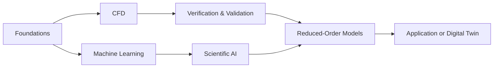

# Learning Paths

[← Main hub](../README.md)

Choose a path based on your current research goal.

| Path | Best for | Outcome |
|---|---|---|
| [Foundations](./foundations.md) | Beginners and researchers strengthening prerequisites | Python, mathematics, numerical thinking and ML readiness |
| [CFD and Numerical Engineering](./cfd.md) | CFD students and engineering researchers | Solver understanding, meshing, verification, validation and application |
| [Scientific AI and ROM](./scientific-ai.md) | Researchers connecting simulation with data-driven methods | DMD, Operator Inference, PINNs, neural operators, surrogates and digital twins |

