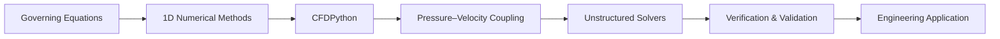

# CFD and Numerical Engineering Path

[← Learning paths](./README.md) · [Main hub](../README.md)

## Goal

Connect governing equations, discretization, solver behavior, verification, validation, and engineering interpretation.

## Suggested sequence

| Stage | Recommended resource | Main outcome |
|---|---|---|
| Introductory solver coding | [CFDPython](https://github.com/barbagroup/CFDPython) | Understand discretization through progressive examples |
| Reinforcement | [Python_CFD](https://github.com/DrZGan/Python_CFD) | Compare implementations and numerical choices |
| Independent practice | [CFD-Python](https://github.com/kangluosee/CFD-Python) | Reproduce and modify additional examples |
| Incompressible coupling | [staggered-grid-lid-driven-cavity](https://github.com/jeddiot/staggered-grid-lid-driven-cavity) | Study pressure–velocity coupling and boundary conditions |
| Solver architecture | [PyCFD](https://github.com/LukeMcCulloch/PyCFD) | Inspect an unstructured solver prototype |
| Discovery | [awesome-fluid-dynamics](https://github.com/lento234/awesome-fluid-dynamics) | Find broader theory, software, and experiments |

## Research checklist

- Define governing equations and modeling assumptions.
- Perform mesh and time-step sensitivity studies.
- Report residuals and physical monitors.
- Compare against experimental or benchmark data.
- Quantify uncertainty and numerical error.
- Separate numerical findings from physical interpretation.

<!-- documentation-status-refresh: 2026-07-16-green-status-refresh -->
