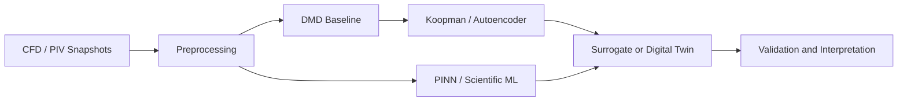

# Scientific AI and Reduced-Order Modeling Path

[← Learning paths](./README.md) · [Main hub](../README.md)

## Goal

Use data-driven methods without losing the physical and numerical understanding required for credible engineering research.

## Suggested sequence

| Stage | Recommended resource | Main outcome |
|---|---|---|
| AI4CFD overview | [ml-cfd-lecture](https://github.com/AndreWeiner/ml-cfd-lecture) | Connect ML concepts to CFD applications |
| Literature review | [Awesome-AI4CFD](https://github.com/WillDreamer/Awesome-AI4CFD) | Identify methods, datasets, and research gaps |
| DMD baseline | [PyDMD](https://github.com/PyDMD/PyDMD) | Extract modes, dynamics, and low-order reconstructions |
| Physics-informed learning | [PINNs](https://github.com/maziarraissi/PINNs) | Study forward, inverse, and discovery formulations |
| Focused sub-hub | [ml-cfd-learning-resources](https://github.com/islam-md-didarul/ml-cfd-learning-resources) | Continue with application-specific resources |

## Model-validation checklist

- Establish a transparent baseline before using a deep model.
- Separate training, validation, and test cases.
- Report reconstruction and prediction errors.
- Test robustness across operating conditions or patients.
- Compare latent dimension, parameter count, and inference time.
- Interpret results using physical quantities, not only loss values.

<!-- documentation-status-refresh: 2026-07-16-green-status-refresh -->
