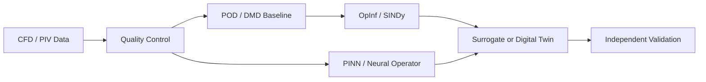

# Scientific AI and Reduced-Order Modeling Path

[← Learning paths](./README.md) · [Main hub](../README.md)

## Goal

Use data-driven methods without losing the physical and numerical understanding required for credible engineering research.

## Suggested sequence

| Stage | Recommended resource | Main outcome |
|---|---|---|
| AI4CFD overview | [ml-cfd-lecture](https://github.com/AndreWeiner/ml-cfd-lecture) | Connect ML concepts to fluid mechanics |
| Fluid-data handling | [flowTorch](https://github.com/AndreWeiner/flowtorch) | Access and preprocess CFD/PIV snapshots |
| DMD baseline | [PyDMD](https://github.com/PyDMD/PyDMD) | Extract modes, frequencies, dynamics, and reconstruction error |
| Physics-structured ROM | [Operator Inference](https://github.com/Willcox-Research-Group/rom-operator-inference-Python3) | Learn non-intrusive polynomial reduced models |
| Equation discovery | [PySINDy](https://github.com/dynamicslab/pysindy) | Identify sparse interpretable dynamical equations |
| PINNs and operator learning | [DeepXDE](https://github.com/lululxvi/deepxde) | Build physics-informed and DeepONet baselines |
| Fourier Neural Operator | [NeuralOperator](https://github.com/neuraloperator/neuraloperator) | Learn maps between input and solution fields |
| Standard benchmark | [PDEBench](https://github.com/pdebench/PDEBench) | Evaluate models across PDE families using multiple metrics |
| Scalable framework | [PhysicsNeMo](https://github.com/NVIDIA/physicsnemo) | Explore advanced, accelerated physics-AI workflows |
| Differentiable simulation | [JAX-Fluids](https://github.com/tumaer/JAXFLUIDS) or [PhiFlow](https://github.com/tum-pbs/PhiFlow) | Differentiate through numerical simulation |

## Model-validation checklist

- Establish a transparent numerical or reduced-order baseline first.
- Split data by independent geometry, patient, operating condition or experiment.
- Prevent temporal and spatial leakage during normalization and patch extraction.
- Report reconstruction, rollout, conservation, and quantity-of-interest errors.
- Compare parameter count, latent dimension, training cost and inference time.
- Test extrapolation separately from interpolation.
- Evaluate long-horizon stability, not only one-step accuracy.
- Use physics-based metrics alongside global loss values.
- Report failed cases and identify where the model should not be trusted.
