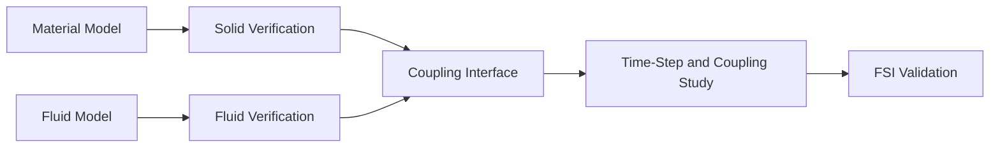

# Solid Mechanics and Fluid–Structure Interaction

[← Project guides](./README.md) · [Main hub](../README.md)

## Research workflow

## Recommended resources

- [felupe](https://github.com/adtzlr/felupe) for continuum-mechanics and FEA learning
- [CFDPython](https://github.com/barbagroup/CFDPython) for numerical-flow foundations
- Relevant solver documentation for the selected coupling platform

## Minimum evidence to report

- Constitutive model and material data
- Independent solid and fluid validation
- Interface mapping and coupling algorithm
- Time-step and convergence sensitivity
- Conservation across the interface
- Comparison with deformation, pressure, force, or frequency measurements

<!-- documentation-status-refresh: 2026-07-16-green-status-refresh -->
