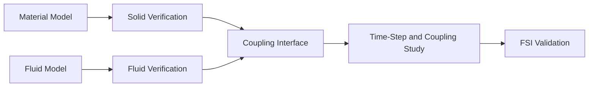

# Solid Mechanics and Fluid–Structure Interaction

[← Project guides](./README.md) · [Main hub](../README.md)

## Research workflow

## Recommended resources

- [felupe](https://github.com/adtzlr/felupe) for nonlinear continuum-mechanics learning.
- [DOLFINx](https://github.com/FEniCS/dolfinx) for custom variational finite-element models.
- [preCICE](https://github.com/precice/precice) for partitioned coupling of independently verified solvers.
- [SU2](https://github.com/su2code/SU2) when its multiphysics and design capabilities match the problem.
- [PyVista](https://github.com/pyvista/pyvista) for interface and deformation inspection.

## Minimum evidence to report

- Constitutive model, material data source, and strain regime
- Independent structural and fluid verification
- Interface geometry, mapping, and sign conventions
- Coupling algorithm and relaxation settings
- Time-step, subiteration, and convergence sensitivity
- Force, displacement, and energy consistency across the interface
- Added-mass stability considerations
- Comparison with deformation, pressure, force, or frequency measurements
