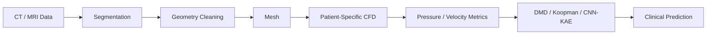

# Medical CFD and Digital Twins

[← Project guides](./README.md) · [Main hub](../README.md)

## Research workflow

## Recommended resource route

[ML Foundations](https://github.com/jonkrohn/ML-foundations)  
→ [CFDPython](https://github.com/barbagroup/CFDPython)  
→ [ml-cfd-lecture](https://github.com/AndreWeiner/ml-cfd-lecture)  
→ [PyDMD](https://github.com/PyDMD/PyDMD)  
→ [Awesome-AI4CFD](https://github.com/WillDreamer/Awesome-AI4CFD)

## Minimum evidence to report

- Imaging and segmentation protocol
- Geometry-cleaning decisions
- Mesh and time-step sensitivity
- Patient-specific boundary conditions
- Solver validation or benchmark comparison
- Physiological flow metrics
- ROM baseline and independent test performance
- Clinical relevance and limitations
