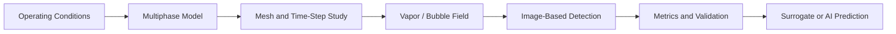

# Multiphase Flow and Cavitation

[← Project guides](./README.md) · [Main hub](../README.md)

## Research workflow

## Recommended resource route

- [OpenFOAM-dev](https://github.com/OpenFOAM/OpenFOAM-dev) for open multiphase and cavitation model exploration.
- [JAX-Fluids](https://github.com/tumaer/JAXFLUIDS) for advanced differentiable compressible two-phase research.
- [BubbleID](https://github.com/cldunlap73/BubbleID) for bubble-field image analysis.
- [OpenPIV](https://github.com/OpenPIV/openpiv-python) when velocity measurements accompany cavitation visualization.
- [ParaView](https://github.com/Kitware/ParaView) and [PyVista](https://github.com/pyvista/pyvista) for vapor-volume and interface metrics.
- [SMT](https://github.com/SMTorg/smt) and [pymoo](https://github.com/anyoptimization/pymoo) for surrogate-based design studies.

## Minimum evidence to report

- Phase properties, dissolved gas assumptions, and initial conditions
- Cavitation or interphase-transfer model
- Nuclei, bubble-size, surface-tension, or vapor-pressure assumptions
- Mesh and time-step sensitivity based on cavitation quantities
- Inception criterion and threshold sensitivity
- Image-processing validation
- Vapor volume, erosion proxy, pressure fluctuation, and efficiency metrics
- Comparison with experiment or an established benchmark
- Limits caused by model form and unresolved scales
