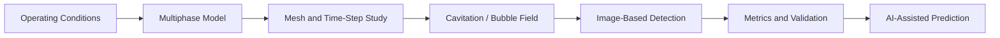

# Multiphase Flow and Cavitation

[← Project guides](./README.md) · [Main hub](../README.md)

## Research workflow

## Recommended resource route

[CFDPython](https://github.com/barbagroup/CFDPython)  
→ [awesome-fluid-dynamics](https://github.com/lento234/awesome-fluid-dynamics)  
→ [BubbleID](https://github.com/cldunlap73/BubbleID)  
→ [Lattice Boltzmann code list](https://github.com/sthavishtha/list-lattice-Boltzmann-codes)  
→ [Awesome-AI4CFD](https://github.com/WillDreamer/Awesome-AI4CFD)

## Minimum evidence to report

- Phase properties and initial conditions
- Cavitation or interphase-transfer model
- Nuclei, bubble-size, or vapor-fraction assumptions
- Mesh and time-step sensitivity
- Image-processing validation
- Cavitation inception, volume, erosion, or bubble metrics
- Comparison with experiment or established benchmark
