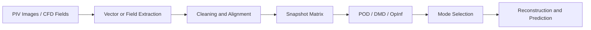

# PIV and Reduced-Order Modeling

[← Project guides](./README.md) · [Main hub](../README.md)

## Research workflow

## Recommended resource route

1. [OpenPIV](https://github.com/OpenPIV/openpiv-python) for scriptable PIV processing or [PIVlab](https://github.com/Shrediquette/PIVlab) for an interactive MATLAB workflow.
2. [PyVista](https://github.com/pyvista/pyvista) and [flowTorch](https://github.com/AndreWeiner/flowtorch) for cleaning, alignment, interpolation, and data access.
3. [PyDMD](https://github.com/PyDMD/PyDMD) for the first modal baseline.
4. [Operator Inference](https://github.com/Willcox-Research-Group/rom-operator-inference-Python3) for physics-structured predictive ROMs.
5. [PySINDy](https://github.com/dynamicslab/pysindy) for interpretable equations in modal coordinates.
6. Neural autoencoders or neural operators only after the linear and polynomial baselines are established.

## Minimum evidence to report

- Image scale, frame rate, interrogation settings and overlap
- Calibration and uncertainty of measured velocity
- Missing-vector, outlier and smoothing treatment
- Spatial interpolation and alignment between experiment and CFD
- Snapshot normalization and weighting
- Rank-selection method and retained energy
- Reconstruction error and frequency uncertainty
- Forecast performance on an unseen time interval or operating condition
- Physical interpretation of coherent structures
