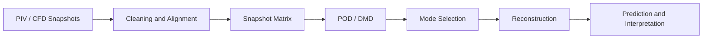

# PIV and Reduced-Order Modeling

[← Project guides](./README.md) · [Main hub](../README.md)

## Research workflow

## Recommended resource route

Python foundations  
→ snapshot preprocessing  
→ [PyDMD](https://github.com/PyDMD/PyDMD)  
→ reconstruction analysis  
→ comparison with learned Koopman or autoencoder models

## Minimum evidence to report

- Spatial and temporal resolution
- Missing-vector or noise treatment
- Snapshot normalization
- Rank-selection method
- Reconstruction error
- Mode frequencies and physical interpretation
- Generalization to unseen time intervals or operating conditions

<!-- documentation-status-refresh: 2026-07-16-green-status-refresh -->
