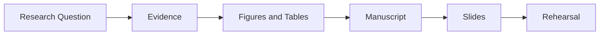

# Research Communication

[← Project guides](./README.md) · [Main hub](../README.md)

## Research-to-presentation workflow

## Recommended resources

- [LaTex-Thesis-Template](https://github.com/samina1/LaTex-Thesis-Template)
- [voice-pro](https://github.com/abus-aikorea/voice-pro)

## Communication checklist

- Lead each section with one clear message.
- Use figures to answer questions, not decorate pages.
- Define symbols, units, assumptions, and comparison conditions.
- Report uncertainty and limitations.
- Separate observations from interpretation.
- End with contribution, significance, and next steps.

<!-- documentation-status-refresh: 2026-07-16-green-status-refresh -->
