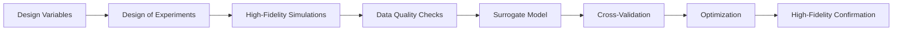

# Surrogate Modeling and Engineering Optimization

[← Project guides](./README.md) · [Main hub](../README.md)

## Workflow

## Recommended resources

- [SMT](https://github.com/SMTorg/smt) for sampling, kriging, RBF, multifidelity, and surrogate benchmarks.
- [pymoo](https://github.com/anyoptimization/pymoo) for constrained multi-objective optimization and Pareto analysis.
- [SU2](https://github.com/su2code/SU2) for adjoint-based design when gradients are available.
- [NeuralOperator](https://github.com/neuraloperator/neuraloperator) for field-to-field surrogates when a sufficiently large dataset exists.
- [PDEBench](https://github.com/pdebench/PDEBench) for learning evaluation practices beyond a single error metric.

## Minimum evidence to report

- Design-variable definitions, bounds and constraints
- Sampling strategy and simulation budget
- Failed-run handling and data-quality checks
- Train/validation/test split by independent design
- Hyperparameter-selection method
- Prediction intervals or uncertainty estimates
- Error in engineering quantities, not only field norms
- Optimization budget and stopping criterion
- Pareto-front stability
- High-fidelity confirmation of selected designs
