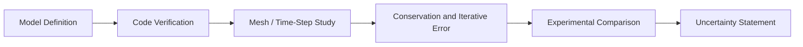

# Verification and Validation for CFD

[← Project guides](./README.md) · [Main hub](../README.md)

## Purpose

Separate four questions that are often incorrectly combined:

1. **Code verification:** Are the equations implemented correctly?
2. **Solution verification:** Is numerical error acceptably small?
3. **Validation:** Does the model represent the physical experiment?
4. **Uncertainty assessment:** How confident are the reported quantities?

## Workflow

## Core resources

- [NASA Turbulence Modeling Resource](https://tmbwg.github.io/turbmodels/) for RANS model definitions and verification cases.
- [ERCOFTAC Classic Collection](https://cfd.mace.manchester.ac.uk/ercoftac/) for established validation cases.
- [JHTDB Giverny](https://github.com/sciserver/giverny) for high-fidelity turbulence data.
- [ParaView](https://github.com/Kitware/ParaView) and [PyVista](https://github.com/pyvista/pyvista) for reproducible extraction of quantities of interest.

## Minimum reporting template

- Governing equations and closure models
- Software version and solver settings
- Geometry and boundary-condition provenance
- Mesh families and refinement ratio
- Quantity-of-interest convergence
- Iterative and temporal convergence
- Conservation errors
- Experimental uncertainty
- Numerical uncertainty
- Model-form limitations
- Validation comparison using matched conditions
